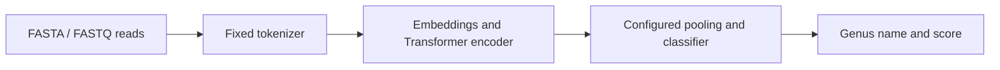

# KmerFormer

**Configurable k-mer Transformers for short-read metagenomic classification.**

KmerFormer assigns 150 bp DNA reads to a trained genus catalogue. Choose
non-overlapping 6-mers, an exact 13-mer vocabulary or hashed 13-mers, with
configurable encoder depth and pooling. Portable bundles include weights,
a fixed tokenizer, class names and the inference protocol.

The study asks when supervised data replace pre-training and how reference
proximity changes tokenizer rankings. Start with the small 6-mer classifier;
the [model guide](docs/MODELS.md) explains the vocabulary and memory choices.



## Install

Use Python 3.11 in a fresh environment. For CPU inference:

```bash
git clone https://github.com/m2lab-ntu/KmerFormer
cd KmerFormer
git checkout release/kmerformer-usable-20260915
python -m venv .venv
source .venv/bin/activate
python -m pip install 'torch>=2.13,<3' --index-url https://download.pytorch.org/whl/cpu
python -m pip install .
```

The command selects the release candidate branch while it is under review.
The repository and its release assets currently require GitHub access.

For GPU use, install a PyTorch build compatible with your CUDA setup, then this
package. KmerFormer itself does not require Transformers or PEFT;
foundation-model adapters use the optional `baselines` extra.

## Classify reads with a trained model

**The trained weights are not currently available for public download.** They
will be released when the paper is accepted, and are available to reviewers on
request in the meantime. `kmerformer-model list` shows the registered models and
reports that none has a public download yet; see
[`weights/README.md`](weights/README.md).

Once you have a bundle — exported from your own checkpoint with
`kmerformer-model export`, or downloaded after release — classification runs
locally with no network access:

```bash
kmerformer-model verify models/6mer-l29
kmerformer-predict --model models/6mer-l29 --reads examples/reads.fa \
  --output predictions.tsv --device cpu
```

The four KmerFormer weight files use Apache-2.0; tokenizer assets keep their
upstream terms, including the 6-mer tokenizer's NonCommercial restriction.
The [weight guide](weights/README.md) records access and component licences.
An existing bundle can be passed directly to `--model`.
Inference itself runs offline.

Output columns are `read_id`, `class_id`, `taxon_name`, `rank`, `score`
and `model_id`. A JSON sidecar records precision, RC-TTA and timing scope.
The first example read is assigned to **Ruminococcus**; complete reference
outputs and provenance are in [examples/](examples/README.md).

Use your own FASTA, FASTQ, `.fa.gz` or `.fastq.gz` with the same command.
Labels are needed only for evaluation. Scores are softmax values over the
trained catalogue; see [model scope](docs/MODELS.md#scope-and-score-interpretation)
before analysing taxa outside it.

```python
from kmerformer import ModelBundle, iter_reads

model = ModelBundle.from_pretrained("models/6mer-l29", device="cpu")
for prediction in model.predict(iter_reads("sample.fastq.gz"), batch_size=128):
    print(prediction["read_id"], prediction["taxon_name"], prediction["score"])
```

## Results

The primary gut closed set contains 100,000 reads and 120 genera. These rows use
a 50M-read training pool; [result records](docs/results_manifest.json) identify
the configurations and evaluation protocols.

<!-- RESULTS_TABLE_START -->
| Model | Closed-set genus Top-1 | Evaluation |
|---|---:|---|
| KmerFormer 6-mer, 29 layers | 69.52% | RC-TTA |
| NT-v2 500M + LoRA, 6-mer | 67.08% | RC-TTA |
| KmerFormer exact 13-mer, 1 layer | 91.15% | RC-TTA |
| MetaTransformer 13-mer, 1 layer | 87.46% | Forward-only |
<!-- RESULTS_TABLE_END -->

At 5M supervised reads, NT-v2 leads the depth-matched scratch model; the ordering
reverses by 50M on gut and soil. Long k-mers achieve higher closed-set accuracy,
while 6-mers retain more accuracy at the distant end of the ANI ladder.
The 6-mer headline model stores 6.45M parameters; NT-v2 stores 500M and adapts
5.54M through LoRA. Storage and trainable parameter counts are reported
separately in [RESULTS](docs/RESULTS.md).

## Train and evaluate

The [training guide](docs/TRAINING.md) covers labelled inputs, shared split
manifests, seeds and checkpoint recovery. The [reproduction guide](docs/REPRODUCE.md)
maps paper configurations to datasets and evaluation commands.

Independent-pool evaluation streams input and writes arrays through disk-backed
storage. RC-TTA is explicit:

```bash
kmerformer-eval --config configs/6mer/L29_50M.yaml --checkpoint /path/to/best.pt \
  --test_fasta /path/to/reads.fa --test_labels /path/to/labels.tsv \
  --output_dir evaluation --rc_tta --skip_save_logits
```

KmerFormer and NT-v2 paper accuracies use RC-TTA; MetaTransformer follows its
authors' forward-only protocol. Exact 13-mer arms train on one GPU with sparse
embedding gradients. Dense-gradient arms also support `torchrun`.

## Reproduce and contribute

- [Reproducibility guide](docs/REPRODUCE.md): software checks, evidence scoring and experiment commands.
- [Evidence catalogue](reproduction/README.md): frozen records and recovered arrays.
- [Data provenance](docs/DATA.md): catalogue construction and pool definitions.
- [Development guide](CONTRIBUTING.md): tests, supported interfaces and releases.
- [Version migration](docs/MIGRATION.md): software versus historical protocols.

```bash
python -m pip install -e '.[review,plots]'
python scripts/reviewer_check.py
```

## Citation

The manuscript is in preparation; citation metadata are in [CITATION.cff](CITATION.cff).
Authors: Ming-Ju Yang, TING-YU YEN, Chien-Yu Chen and Joyce Tzu-Yu Liu.
Affiliations and supplied identifiers are recorded in `CITATION.cff`.

## Licence

Code is [MIT](LICENSE). The fixed NT-v2 tokenizer vocabulary retains
[upstream attribution and terms](kmerformer/assets/NOTICE.md).
Weights and external data have their own terms, recorded in the
[weight guide](weights/README.md) and [data guide](docs/DATA.md).
